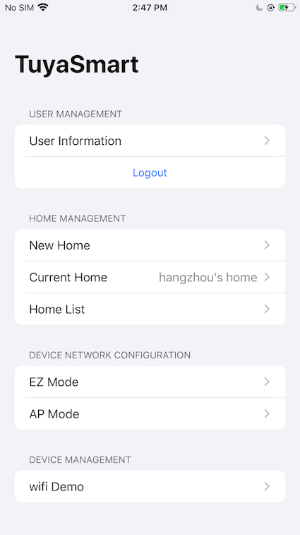
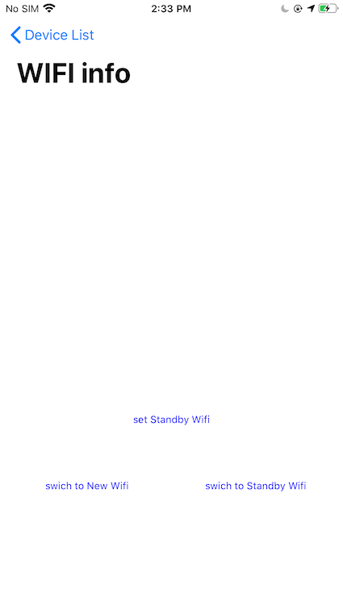

# Backup Wi-Fi Switch Sample for Objective-C

[中文版](README_zh.md) | [English](README.md)

 The standby network is to save the WiFi and password to the device. When the device is currently connected to WIFI and there is no network, the device can fetch the saved WIFI by itself. You can also actively switch through the app. The device standby network sample is provided here.

The main functions are as follows:

- Gets the current network of the device
- Switching device network
- Get and set up the standby network

**(This feature must be tested with a real device)**




## Requirements

- Xcode 12.0 and later
- iOS 12 and later

## Using this Sample

1. The Tuya HomeSDK is distributed through [CocoaPods](http://cocoapods.org/), as well as other dependencies in this sample. Please make sure you have CocoaPods installed, if not, install it first:

```bash
sudo gem install cocoapods
pod setup
```

2. Clone or download this sample, change the directory to the one with **Podfile** in it, then run the following command:

```bash
pod install
```

3. This sample requires you to have a pair of keys and a secure image from [Tuya IoT Platform](https://developer.tuya.com/), register a developer account if you don't have one, then follow the following steps:

   1. In the IoT platform, under the `App` side panel, choose `SDK Development`.
   2. Creating an App by clicking `Create` button.
   3. Fill in the required information. Please make sure you type in the correct Bundle ID, it cannot be changed afterward.
   4. You can find the AppKey, AppSecret, and security image under the `Obtain Key` tag.

4. Open the `TuyaAppSDKSample-iOS-ObjC.xcworkspace` that pod generated for you.
5. Fill in the AppKey and AppSecret in `AppKey.h` file.

```objective-c
#define APP_KEY @"<#AppKey#>"
#define APP_SECRET_KEY @"<#SecretKey#>"
```

6. Download the security image and rename it to `t_s.bmp`, then drag it into the workspace to be at the same level as `Info.plist`.

**Note:** The bundle ID, AppKey, AppSecret, and security image must be the same as your App in Tuya IoT Platform; otherwise, the sample cannot successfully request the API.
