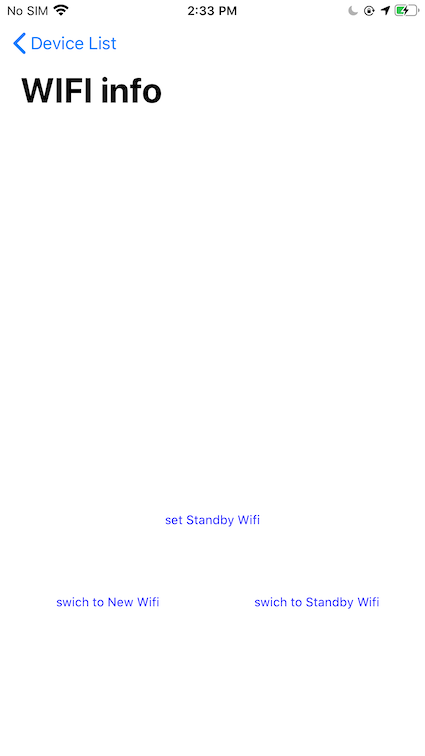

# 备用网络切换 Sample

[中文版](README_zh.md) |[English](README.md)

备用网络就是将wifi和密码保存到设备端。当设备当前连接wifi没有网络时候，设备可以自己取连接已保存的wifi。也可以通过app进行主动切换。这里提供设备备用网络案例。

主要功能如下：

 - 获取设备当前网络
 - 切换设备网络
 - 获取、设置备用网络
 

 **(此功能必须使用真实设备进行测试)**




## 要求

- Xcode 12.0及更高版本
—iOS 12及以上版本

## 使用这个示例

1. Tuya HomeSDK通过[CocoaPods](http://cocoapods.org/)以及本示例中的其他依赖项进行分发。请确保你已经安装了CocoaPods，如果没有，请先安装它:

```bash
sudo gem install cocoapods
pod setup
```

2. 克隆或下载此示例，将目录更改为包含**Podfile**的目录，然后运行以下命令:

```bash
pod install
```

3.本示例需要您有一对密钥和一个来自[Tuya物联网平台](https://developer.tuya.com/)的security image，如果您没有一个开发者帐户，请注册一个开发者帐户，然后遵循以下步骤:

1. 在物联网平台的“App”侧板下，选择“SDK Development”。
2. 点击“创建”按钮创建应用程序。
3.填写所需的信息。请确保您输入了正确的Bundle ID，之后就无法更改了。
4. 您可以在“获取密钥”标签下找到AppKey、AppSecret和security image。
4. 打开pod生成的 `TuyaAppSDKSample-iOS-ObjC.xcworkspace`
5. 在 `AppKey.h` 文件填写AppKey和AppSecret

```objective-c
#define APP_KEY @"<#AppKey#>"
#define APP_SECRET_KEY @"<#SecretKey#>"
```
6. 下载安全图片并将其重命名为' t_s。'，然后将它拖到与' Info.plist '同级的工作空间中。

**注:** bundle ID、AppKey、AppSecret、security image必须与Tuya IoT平台中的App相同;否则，示例无法成功请求API。